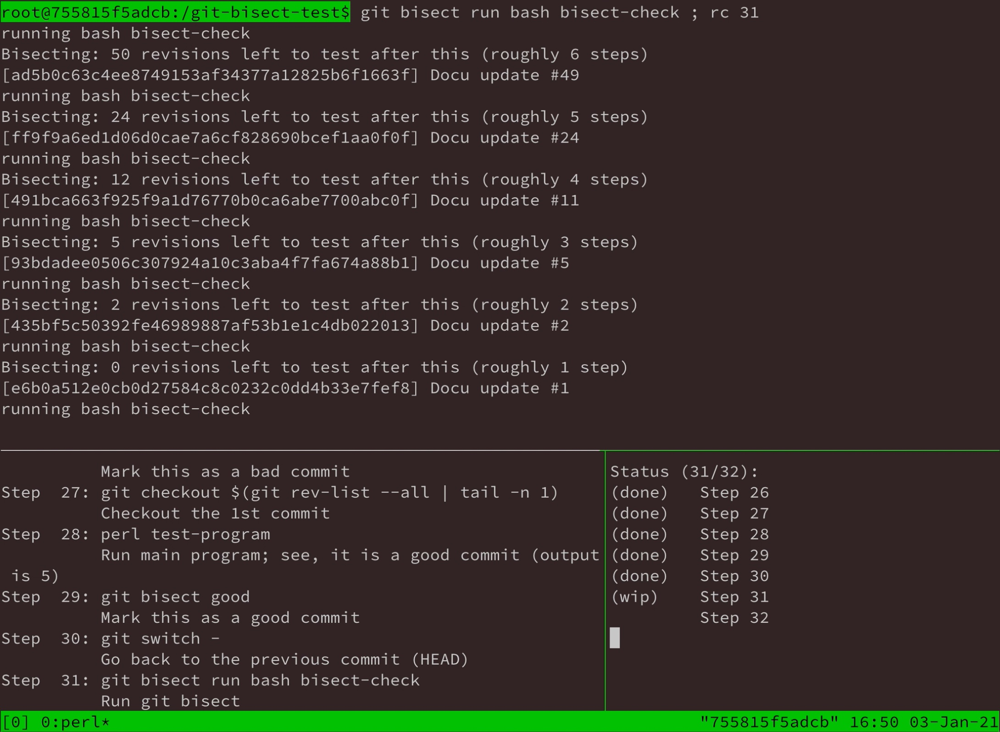

# screencast-tutorials
Trying to record some tutorials about software installation and other things.

1. The steps for each 'tutorial' are specified in a yml file.
2. `run-tests` is called inside a Ubuntu docker container, which runs the yml file
3. It starts a tmux session to show the output of the commands (upper panel), the commands (lower left panel), and the step list (lower right panel).

## Sample: git bisect

For example, how does it look when "git bisect" is doing its work?

`docker run -it --rm -v $PWD:/scripts ubuntu /bin/bash /scripts/run-tests git-bisect-sample.yml` 

1. There's a sample program that should always print "5".
2. The git repository (not this one) is about 200 commits.
3. Now, the sample program prints "6".
4. So somewhere in the commit history the program is broken.
5. A check script is written (`bisect-check`), which checks the program (rc 0 meaning commit is okay, rc 1 means commit is bad)
6. Running `git bisect run bash bisect-check` to find out the bad commit

Recording by asciinema is done using this command:
`asciinema rec --overwrite -c "docker run -it --rm -v $PWD:/scripts ubuntu /bin/bash /scripts/run-tests git-bisect-sample.yml" recording.cast`

## Sample: reveal.js installation

`asciinema rec --overwrite -c "docker run -it --rm -v $PWD:/scripts ubuntu /bin/bash /scripts/run-tests reveal-js_full-setup.yml" recording.cast`

